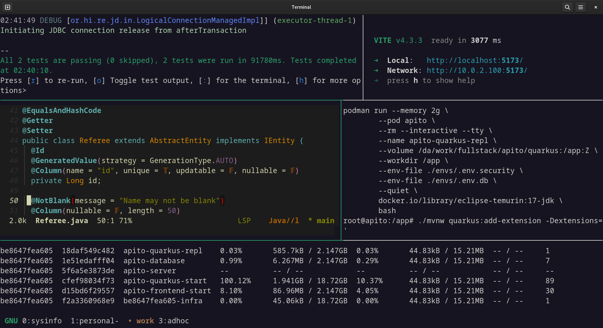

<!--
 apito-aspnet is free software: you can redistribute it and/or modify
 it under the terms of the GNU General Public License as published by
 the Free Software Foundation, either version 3 of the License, or
 (at your option) any later version.
 
 apito-aspnet is distributed in the hope that it will be useful,
 but WITHOUT ANY WARRANTY; without even the implied warranty of
 MERCHANTABILITY or FITNESS FOR A PARTICULAR PURPOSE.  See the
 GNU General Public License for more details.
 
 You should have received a copy of the GNU General Public License
 along with apito-aspnet. If not, see <https://www.gnu.org/licenses/>.
-->

# Apito | ASP.NET

Evaluate soccer referees' performance.

[Symfony](https://gitlab.com/easbarba/apito-symfony) [Express](https://gitlab.com/easbarba/apito-express) |  [Vue.js](https://gitlab.com/easbarba/apito-vue) | [Quarkus](https://gitlab.com/easbarba/apito-quarkus) |  [Main](https://gitlab.com/easbarba/apito)

## [Documentation](docs)

All information about API design, openAPI, and related documentation are found at the `docs`.

## [Makefile](Makefile)

The Makefile file provides all sort of handy tasks. It relies on the `.env.*`
files, so make sure to match due variables.

| goals   | description                                         |
| ------- | --------------------------------------------------- |
| prod    | spin up containers to production local testing      |
| start   | spin up containers for development                  |
| repl    | spin up an openjdk container to run ad-hoc commands |
| publish | tag and push last release container images          |

## [Podman Pods](https://podman.io)

Podman's pod offers a rootless k8s's pods-like experience to local development, [check it out!](https://developers.redhat.com/blog/2019/01/15/podman-managing-containers-pods#shortcut_to_create_pods)

Some targets are using pods to boot up necessary containers, look at the `Makefile` for more infromation.

For more information on development check out the `CONTRIBUTING.md` document.

## [apitest](apitest)

A custom script is provided, as alternative, to test all endpoints easily, it has a few dependencies listed in its top.

    ./apitest
    ./apitest 29fe4068-fdf8-4775-acc0-140c4d066612

## LICENSE

[GNU GENERAL PUBLIC LICENSE Version 3](https://www.gnu.org/licenses/gpl-3.0.en.html)
